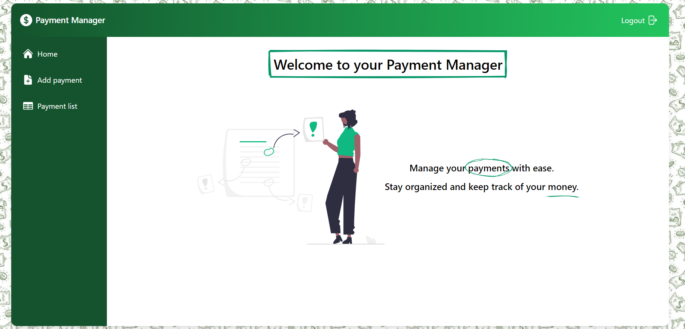

# <div align="center">Challenge Tecnico</div>

Aplicacion fullstack con Frontend en React + Tailwind y backend en Node + Express y postgreSQL como motor de bases de datos.

## Stack

Front end

- React 18.2
- Tailwind.css
  
Otros paquetes

        @heroicons/react": "^2.1.3", // Iconos
		"formik": "^2.4.5", // Manejo de formularios
		"moment": "^2.30.1", // Manejo de fechas
		"react-csv": "^2.2.2", // Export a CSV
		"react-rough-notation": "^1.0.5", // Estilado con animaciones
		"react-select": "^5.8.0", // Select input custom
		"react-tailwindcss-datepicker": "^1.6.6" // Date picker con Tailwind


Back end

- Node 20.11.1
- Express.js 4.19
- Sequelize 6.37
- Jsonwebtoken 9.0


## Como probar

1. Descargar el repositorio
2. Instalar dependencias
   ```
   npm install
   ```
3. npm run dev
   ```
   npm run dev
   ```


## Screenshots
<div style="display:flex; justify-content: center"> 



</div>
